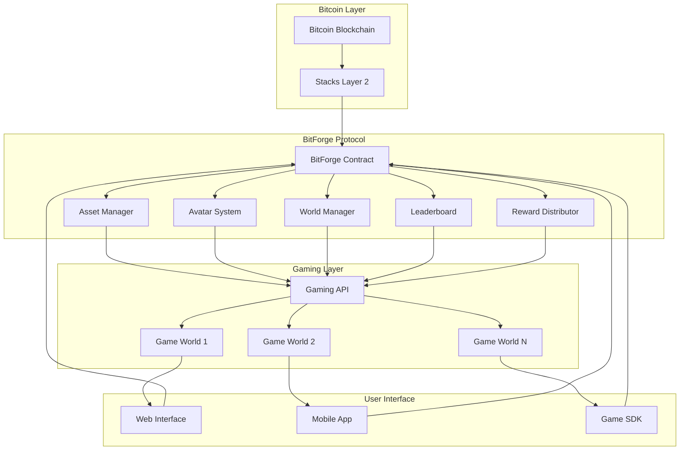
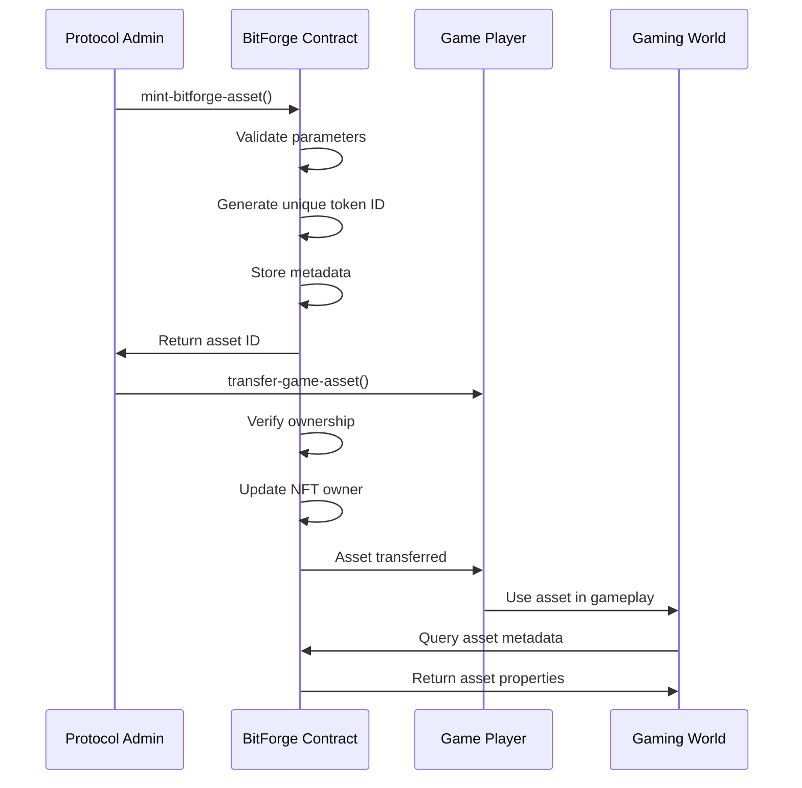
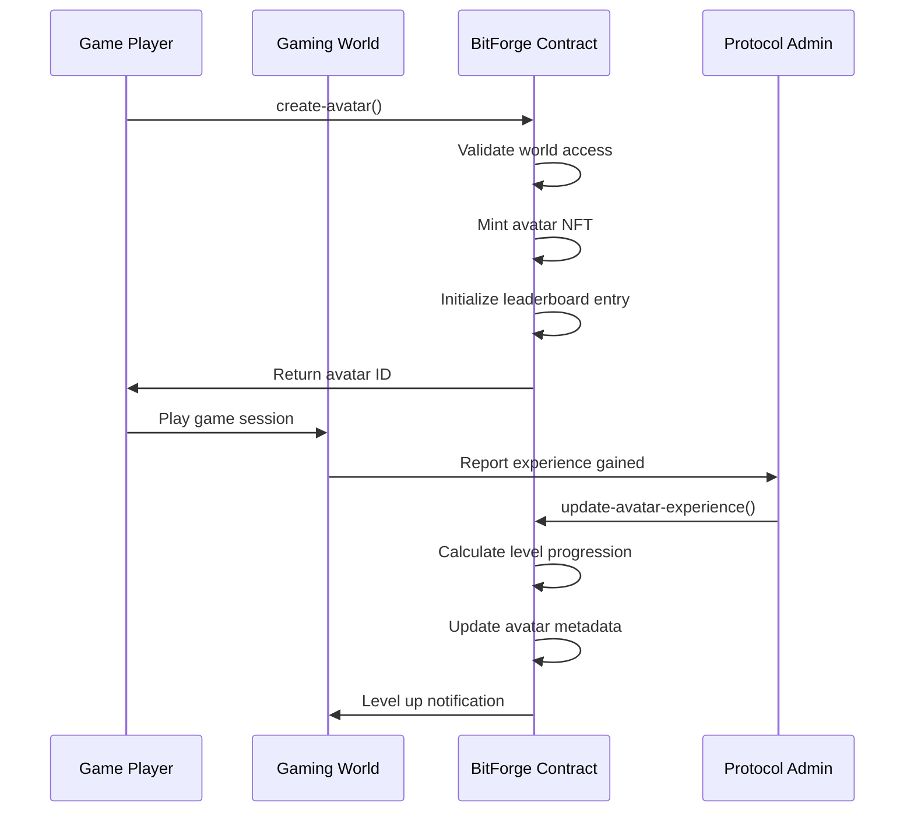
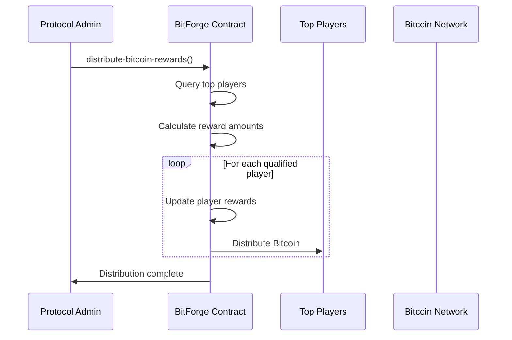

# BitForge Gaming Protocol


> **A Bitcoin-native gaming infrastructure protocol that powers cross-chain gaming economies with provably fair mechanics, asset sovereignty, and Bitcoin-secured value exchange across virtual worlds.**

## 🎯 Overview

BitForge revolutionizes blockchain gaming by creating a unified Layer 2 ecosystem where digital assets transcend individual games. Built on Stacks with Bitcoin's security guarantees, the protocol enables true digital asset ownership, cross-game interoperability, and sustainable gaming economies.

### Key Features

- 🔐 **Bitcoin Security**: All assets secured by Bitcoin's immutable ledger
- 🎮 **Cross-Game Assets**: NFTs that work across multiple gaming worlds
- ⚡ **Lightning Fast**: High-performance gaming with minimal transaction costs
- 🏆 **Competitive Gaming**: Decentralized tournaments and leaderboards
- 👤 **Player Identity**: Persistent avatars with progression systems
- 🌍 **Virtual Worlds**: Expandable gaming multiverse
- 💰 **True Ownership**: Players control their digital assets completely

## 🏗️ System Architecture



## 🔧 Contract Architecture

### Core Components

#### 1. **Asset Management System**
- **NFT Assets**: Cross-game compatible items with rarity, power levels, and attributes
- **Metadata Storage**: Comprehensive asset information including experience and level progression
- **Transfer Mechanics**: Secure peer-to-peer asset trading

#### 2. **Avatar System**
- **Player Identity**: Persistent avatars across all game worlds
- **Progression Tracking**: Experience, levels, and achievement systems
- **Equipment Management**: Asset attachment and world access permissions

#### 3. **World Management**
- **Virtual Worlds**: Expandable gaming environments with custom requirements
- **Access Control**: Entry requirements and player capacity management
- **Reward Pools**: World-specific prize distribution systems

#### 4. **Competitive Infrastructure**
- **Leaderboards**: Global and world-specific player rankings
- **Tournament System**: Automated competition management
- **Reward Distribution**: Merit-based Bitcoin reward allocation

### Smart Contract Structure

```
BitForge Gaming Protocol
├── Constants & Configuration
│   ├── Error Codes (24 types)
│   ├── Game Mechanics (levels, experience)
│   └── Protocol Settings (fees, limits)
├── Data Storage
│   ├── Asset Metadata Maps
│   ├── Avatar Information Maps
│   ├── World Configuration Maps
│   └── Leaderboard Data Maps
├── Core Functions
│   ├── Asset Minting & Transfer
│   ├── Avatar Creation & Leveling
│   ├── World Management
│   └── Score & Reward Systems
└── Utility Functions
    ├── Validation Logic
    ├── Experience Calculations
    └── Access Control
```

## 📊 Data Flow

### Asset Creation & Transfer Flow



### Avatar Progression Flow



### Reward Distribution Flow



## 🚀 Getting Started

### Prerequisites

- Stacks wallet (Hiro Wallet recommended)
- Bitcoin testnet/mainnet access
- Node.js 16+ for development tools

### Installation

```bash
# Clone the repository
git clone https://github.com/abdulbasit-hash/bitforg-gaming.git
cd bitforge-gaming

# Install dependencies
npm install

# Deploy to testnet
npm run deploy:testnet

# Deploy to mainnet
npm run deploy:mainnet
```

### Quick Start

```javascript
// Initialize gaming session
const gameSession = new BitForgeSession({
    contractAddress: 'ST1PQHQKV0RJXZFY1DGX8MNSNYVE3VGZJSRTPGZGM.bitforge-gaming',
    network: 'testnet'
});

// Create player avatar
const avatar = await gameSession.createAvatar({
    name: "CyberWarrior",
    worldAccess: [1, 2, 3]
});

// Mint game asset
const asset = await gameSession.mintAsset({
    name: "Lightning Sword",
    rarity: "legendary",
    powerLevel: 850,
    worldId: 1
});
```

## 🔐 Security Features

- **Bitcoin-Secured**: All assets inherit Bitcoin's security model
- **Multi-Signature Support**: Administrative functions require consensus
- **Access Control**: Role-based permissions for protocol operations
- **Validation Layer**: Comprehensive input sanitization and bounds checking
- **Audit Trail**: Complete transaction history on Bitcoin blockchain

## 🤝 Contributing

We welcome contributions from the gaming and Bitcoin communities! Please read our [Contributing Guidelines](CONTRIBUTING.md) and [Code of Conduct](CODE_OF_CONDUCT.md).

### Development Workflow

1. Fork the repository
2. Create a feature branch (`git checkout -b feature/amazing-feature`)
3. Make your changes
4. Add tests for new functionality
5. Commit your changes (`git commit -m 'Add amazing feature'`)
6. Push to the branch (`git push origin feature/amazing-feature`)
7. Open a Pull Request

## ⚡ Built With

- [Stacks](https://stacks.co) - Bitcoin Layer 2 for smart contracts
- [Clarity](https://clarity-lang.org) - Safe, decidable smart contract language
- [Bitcoin](https://bitcoin.org) - Decentralized digital currency and security layer

---

**BitForge Gaming Protocol** - *Forging the Future of Bitcoin Gaming* 🎮⚡